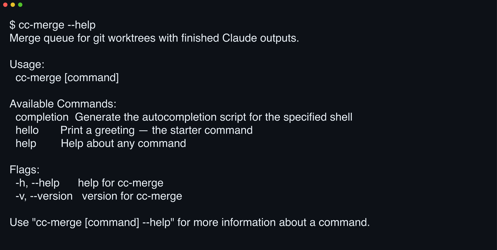

# 

**Stop being your agents' merge queue.** cc-merge queues the worktrees your parallel Claude sessions leave behind, rebases each onto tip, runs your checks, and merges only what passes.

[](https://github.com/yasyf/cc-merge/actions/workflows/ci.yml)
[](https://github.com/yasyf/cc-merge/blob/main/LICENSE)

## Get started

```bash
brew install yasyf/tap/cc-merge
cc-merge --help
```



Driving with an agent? Paste this:

```text
Install cc-merge with `brew install yasyf/tap/cc-merge`.
Queue my finished Claude Code worktrees and land them on main one at a time,
rebasing each onto the current tip and running the repo's checks before each merge.
Stop and tell me the moment a rebase conflicts or a check fails.
```

---

## Use cases

### Land a fleet of finished agents without babysitting the merge order

Six sessions finish within minutes of each other, and suddenly you're the merge queue, deciding who lands first and re-running checks after every rebase. cc-merge takes that job: it picks the order, lands one worktree at a time, and stops the queue the moment something needs a human.

### Keep main green when every branch was only tested in isolation

Each branch was green against the `main` it started from, not the `main` it lands on. cc-merge rebases every finished worktree onto the current tip and re-runs your checks before merging, so a merge that would break `main` never reaches it.

### See what's ready, what's blocked, and what already landed

Finished worktrees pile up, and a day later you can't tell which are merged, which are waiting, and which are stuck on a conflict. cc-merge reads the queue and reports each worktree as ready, blocked, or landed. No archaeology through `git worktree list`.

Status: early scaffold — CI, goreleaser, and the Homebrew cask are wired end to end; the queue engine is what lands next. Licensed under [PolyForm Noncommercial 1.0.0](LICENSE).
