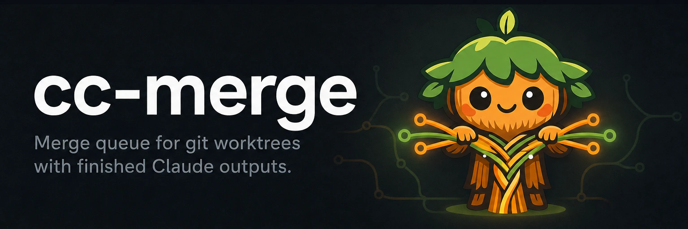

# cc-merge



[](https://github.com/yasyf/cc-merge/releases)
[](https://github.com/yasyf/cc-merge/actions/workflows/ci.yml)
[](https://github.com/yasyf/cc-merge/blob/main/LICENSE)

Merge queue for git worktrees with finished Claude outputs.

cc-merge is a merge queue for the git worktrees your parallel Claude Code sessions
leave behind. Point it at the worktrees that hold finished work and it lands them on
your mainline one at a time, rebasing each onto the current tip and running your checks
before it merges, so a dozen agents can finish at once without you serializing the
merges by hand.

## Install

Homebrew (macOS):

```bash
brew install yasyf/tap/cc-merge
```

Or with the Go toolchain:

```bash
go install github.com/yasyf/cc-merge/cmd/cc-merge@latest
```

## Quickstart

Confirm the install works:

```bash
cc-merge hello
```

```
Hello from cc-merge!
```

## What problems does this solve?

- **Parallel agents finish faster than you can merge them.** Spin up a fleet of Claude
  Code sessions and they all land branches at once. cc-merge serializes the merges so
  you stop babysitting which worktree goes first.
- **A branch that's green in isolation isn't a green mainline.** cc-merge rebases each
  finished worktree onto the current tip and runs your checks before it merges, so a
  merge that would break `main` never reaches it.
- **Finished worktrees pile up and you lose track of what's done.** cc-merge reads the
  queue and tells you what's ready, what's blocked, and what already landed.
- **Hand-merging N branches drops the order that matters.** cc-merge picks a merge
  order, re-runs the ones that conflict after a rebase, and stops the queue the moment
  something needs a human.
